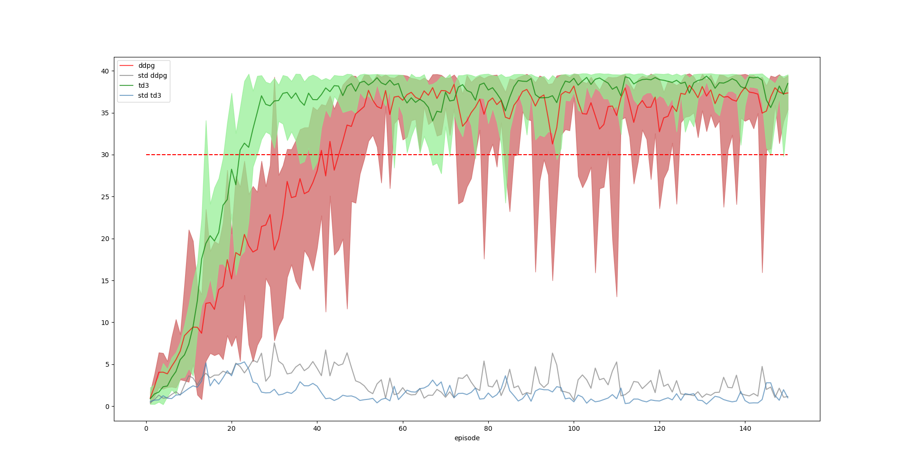

[//]: # (Image References)

[image1]: https://user-images.githubusercontent.com/10624937/43851024-320ba930-9aff-11e8-8493-ee547c6af349.gif "Trained Agent"

# Project 2: Continuous Control

### Introduction

For this project, I worked with the [Reacher](https://github.com/Unity-Technologies/ml-agents/blob/master/docs/Learning-Environment-Examples.md#reacher) environment.

![Trained Agent][image1]

In this environment, a double-jointed arm can move to target locations. A reward of +0.1 is provided for each step that the agent's hand is in the goal location. Thus, the goal of your agent is to maintain its position at the target location for as many time steps as possible.

The observation space consists of 33 variables corresponding to position, rotation, velocity, and angular velocities of the arm. Each action is a vector with four numbers, corresponding to torque applicable to two joints. Every entry in the action vector should be a number between -1 and 1.

### Distributed Training

For this project, I was using the second version of the Unity environment which contains 20 identical agents, each with its own copy of the environment.  

#### Option 2: Solve the Second Version

The barrier for solving the second version of the environment is slightly different, to take into account the presence of many agents.  In particular, your agents must get an average score of +30 (over 100 consecutive episodes, and over all agents).  Specifically,
- After each episode, we add up the rewards that each agent received (without discounting), to get a score for each agent.  This yields 20 (potentially different) scores.  We then take the average of these 20 scores. 
- This yields an **average score** for each episode (where the average is over all 20 agents).

The environment is considered solved, when the average (over 100 episodes) of those average scores is at least +30. 

### Solution
The solution is described in detail in [Solution Notebook](Solution.ipynb) and the [Report.md](Report.md)
I was using in the beginning the DDPG and later moved to the TD3 as successor of DDPG developed 2018 by Scott Fujimoto, Herke van Hoof, and David Meger [paper](https://arxiv.org/pdf/1802.09477.pdf)

### Installation
For the project I mainly used my desktop pc with installed Linux.

The python installation is based on anaconda, for better CUDA support within torch. I installed the necessary packages with pip using the description in udacitys deep-reinforcement-learning repository.

        chmod a+x ~/Downloads/Anaconda3-2020.02-Linux-x86_64.sh 
        sudo ~/Downloads/Anaconda3-2020.02-Linux-x86_64.sh 
        conda create -n drlnd python=3.6
        conda activate drlnd

        git clone https://github.com/udacity/deep-reinforcement-learning.git

        cd deep-reinforcement-learning/python
        pip install .
        cd ..
        git clone https://github.com/openai/gym.git
        cd gym/
        pip install .
        pip install .[all]
