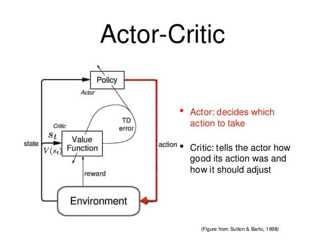
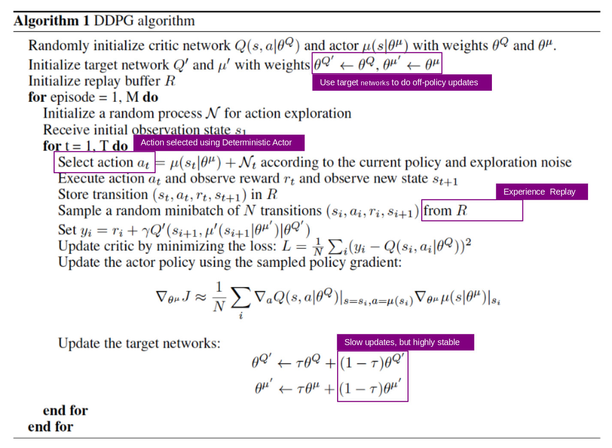
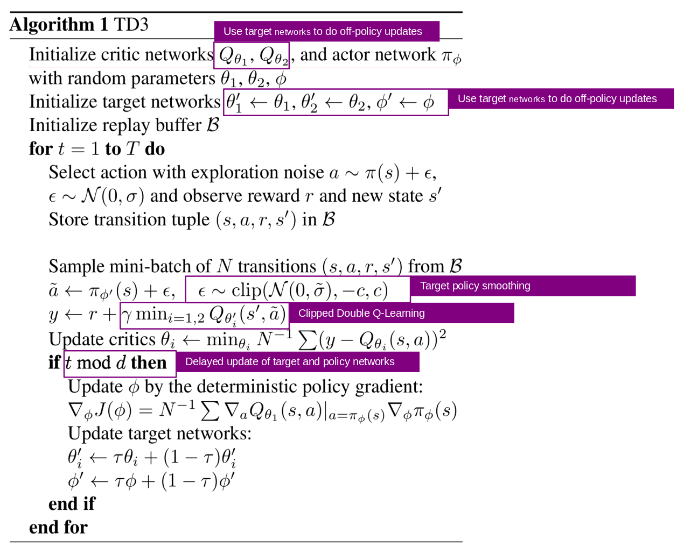
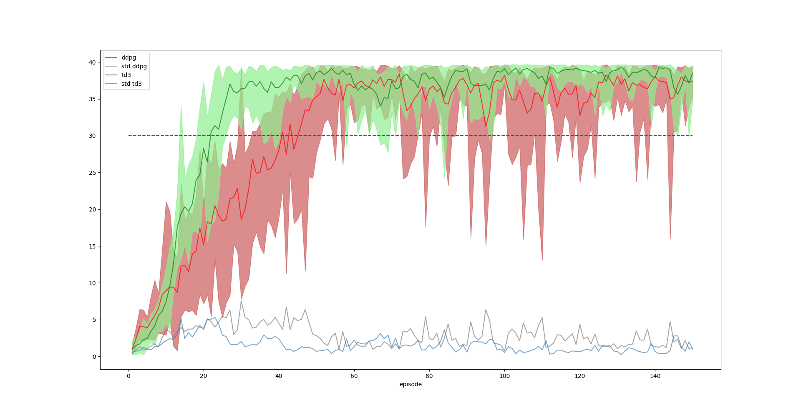
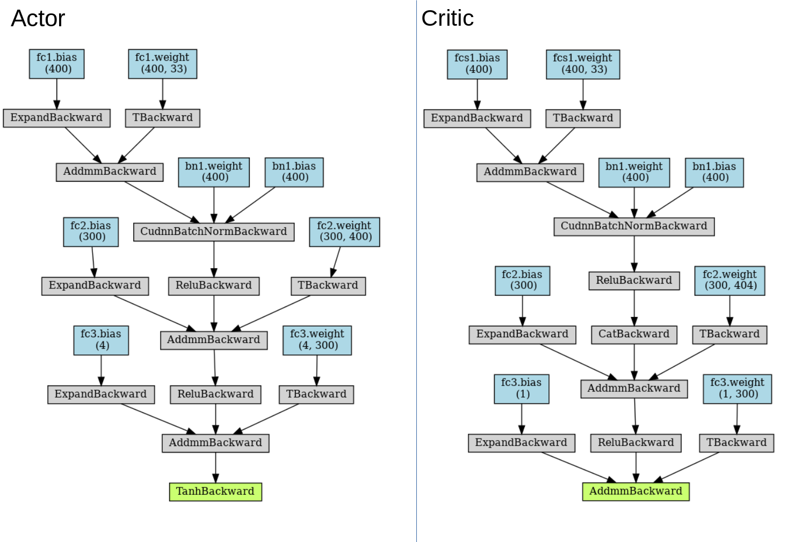
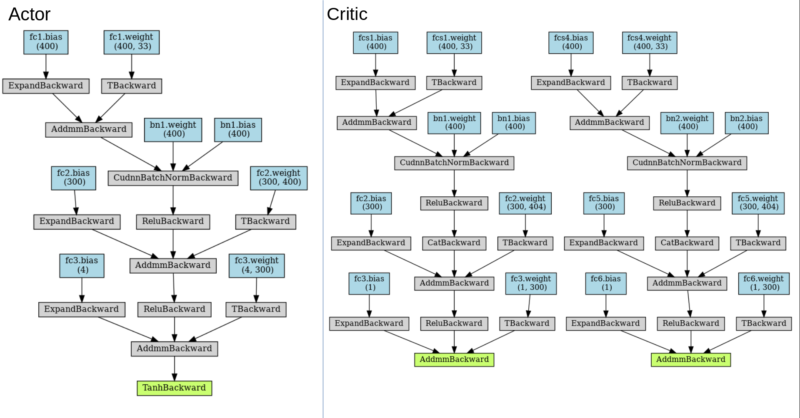

# Introduction
# Implementation
My implementation is based on https://github.com/udacity/deep-reinforcement-learning/blob/master/ddpg-pendulum/ddpg_agent.py and the explanation regarding the benchmark implementation.  

## Summary *Actor Critics* Model
The basic idea is to divide the model into two parts: one to calculate an action based on a state and another to generate the Q values of the action. The actor takes the state as the input and output of the best action. It essentially controls how the actor behaves by learning the optimal (policy-based) policy. The critic, on the other hand, evaluates the action by calculating the value function (value-based). These two models participate in the job in which they both improve over time in their own roles. The result is that the overall architecture learns to solve the task more efficiently than the two methods alone. 
source: https://theaisummer.com/Actor_critics/

# Improvements in DDPG( Deep Deterministic Policy Gradient )
Paper: https://arxiv.org/pdf/1509.02971.pdf 

It was very helpful to study https://towardsdatascience.com/deep-deterministic-policy-gradients-explained-2d94655a9b7b

**Target network**: Using two deep networks θ- and θ for actor. Using the first one to retrieve Q values while the second one includes all updates in the training. After some updates, we synchronize θ- with θ. The purpose is to fix the Q-value targets temporarily so we don’t have a moving target to chase. In addition, parameter changes do not impact θ- immediately and therefore even the input may not be 100% iid (Independent and identically distributed random variables)

**Experience replay**: Put the transitions into a buffer and take a sample from a mini-batch of 128-size samples from this buffer to train the deep network. This forms an input data set that is more stable for training. As the randomly sample of the playback buffer, the data is more independent of each other and closer to the iid (independent and identically distributed).

**Ornstein-Uhlenbeck process** The Ornstein-Uhlenbeck Process generates noise that is correlated with the previous noise, as to prevent the noise from canceling out or *freezing* the overall dynamics <cite>https://www.quora.com/Why-do-we-use-the-Ornstein-Uhlenbeck-Process-in-the-exploration-of-DDPG/answer/Edouard-Leurent?ch=10&share=4b79f94f&srid=udNQP</cite>

# Improvements using TD3
Paper:https://arxiv.org/pdf/1802.09477.pdf

After some research I found TD3 as a successor to the previously predicted best solution DDPG. I was able to introduce the small adaptations easily after studying.

https://towardsdatascience.com/td3-learning-to-run-with-ai-40dfc512f93

**Target Policy Smoothing:** TD3 introduced a smoothing regularization strategy on the value function: adding a small amount of clipped random noises to the selected action and averaging over mini-batches. 

**Clipped Double Q-learning:** The Clipped Double Q-learning instead uses the minimum estimation among two so as to favor underestimation bias

**Delayed update of Target and Policy Networks:** To reduce the variance, TD3 updates the policy at a lower frequency than the Q-function. The policy network stays the same until the value error is small enough after several updates. 

# TD3 vs DDPG

# Model
Model parameters like dimensions were taken from https://github.com/udacity/deep-reinforcement-learning/blob/master/ddpg-pendulum/model.py and showed a good performance. I have created an export of the networks via https://github.com/szagoruyko/pytorchviz
## DDPG

## TD3

# Training

N_EPISODES = 150
MAX_T = 10000
SOLVED_SCORE = 30
SAVE_N_EPISODES = 5
CKPT_PATH = trained_test

# Hyperparamters
Hyperparameter | Value | Info
--- | --- | ---
BUFFER_SIZE | int(1e6)  | replay buffer size of the memory containing the batch samples.
BATCH_SIZE | 128         | minibatch size, number of samples used during an update (gradient descent).
GAMMA | 0.99            | discount factor ∈ [0, 1] defines up to what extent future rewards influence the return in time step t.
TAU | 1e-3              | for soft update of target parameters
LR_ACTOR | 0.001               | learning rate of the actor
LR_CRITIC | 0.001               | learning rate of the critic
WEIGHT_DECAY | 0 | L2 weight decay
LEARN_EVERY | 20 | learning timestep interval  
LEARN_NUM | 10 | number of learning passes
OU_SIGMA | 0.2 | Ornstein-Uhlenbeck noise parameter
OU_THETA | 0.15 | Ornstein-Uhlenbeck noise parameter
EPSILON | 1.0 | explore->exploit noise process added to act step
EPSILON_DECAY  | 0.000001 | decay rate for noise process

# Ideas for Future Work
